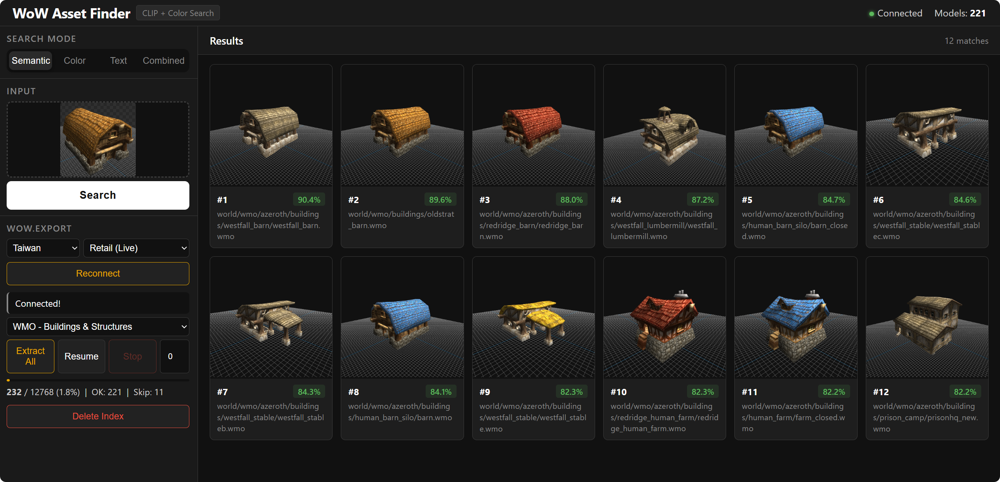

# WoW Asset Finder

> CLIP + FAISS powered World of Warcraft model asset similarity search tool
>
> CLIP + FAISS 驱动的魔兽世界模型资产相似度搜索工具



---

## Features / 功能特性

- **Image Search / 图片搜索** — Upload or paste a reference image to find similar game models / 上传或粘贴参考图，找出最相似的游戏模型
- **Text Search / 文字搜索** — Describe what you're looking for in English (e.g. "stone bridge", "wooden barrel") / 输入英文描述直接搜索
- **Color Search / 配色搜索** — Match by color distribution / 按颜色分布匹配风格配色相近的模型
- **Combined Search / 混合搜索** — Weighted combination of image + text / 图片 + 文字加权组合
- **Live Thumbnails / 实时缩略图** — Results rendered in real-time from wow.export (not stored) / 搜索结果实时渲染预览
- **Category Extraction / 分类提取** — Extract by category (WMO/Creatures/Items...) with resume support / 按类别独立提取，支持断点续传

---

## Search Modes / 搜索模式

| Mode / 模式 | Input / 输入 | Description / 说明 |
|------|------|------|
| **Semantic** | Image / 图片 | CLIP semantic matching / CLIP 语义匹配 |
| **Color** | Image / 图片 | HSV histogram matching / HSV 颜色直方图匹配 |
| **Text** | Text / 文字 | Natural language search / 自然语言描述搜索 |
| **Combined** | Both / 两者 | Multi-dimensional weighted fusion / 多维度加权融合 |

---

## Quick Start / 快速开始

### 1. Install / 安装

```bash
git clone https://github.com/new-tonAA/wow.export-asset-finder.git
cd wow.export-asset-finder
python -m venv venv
venv\Scripts\activate
pip install -r requirements.txt
```

> For PyTorch GPU acceleration, visit https://pytorch.org for your CUDA version
>
> PyTorch GPU 加速请按 https://pytorch.org 选择对应 CUDA 版本

### 2. Prerequisites / 前置条件

- Python 3.10+
- [wow.export](https://github.com/Kruithne/wow.export) debug build at `C:\wow.export\wow.export\bin\win-x64-debug\`
- Access to Blizzard CDN (Taiwan region recommended) / 能访问暴雪 CDN（建议选 Taiwan 区域）

### 3. Launch / 启动

**Windows:** Double-click `start.vbs` / 双击 `start.vbs`

**Manual / 手动:**
```bash
venv\Scripts\python app.py
```

CLIP model loads in ~40 seconds, then browser opens automatically at http://localhost:5001

CLIP 模型加载约 40 秒，完成后自动打开浏览器

### 4. Usage / 使用

1. **Connect** — Select region & version, connect wow.export to Blizzard CDN / 选择区域和版本，连接暴雪 CDN
2. **Extract** — Choose model category, click Extract All / 选择模型类别，点击 Extract All 提取特征向量
3. **Search** — Upload image / Ctrl+V paste / enter text description / 上传图片、粘贴、或输入文字

---

## Model Categories / 模型类别

| Category / 类别 | Content / 内容 | Count / 数量 |
|------|------|------|
| WMO - Buildings & Structures | Castles, churches, bridges, towers / 城堡、教堂、桥梁、塔楼 | ~12,000 |
| Creatures | Creature models / 生物模型 | - |
| Items | Item models / 物品模型 | - |
| Characters | Character models / 角色模型 | - |
| Doodads & Props | Barrels, fences, lamps / 桶、栅栏、灯具 | - |
| Environment | Rocks, trees / 岩石、树木 | - |
| Spells & Effects | Spell effects / 法术特效 | - |
| All Models | Everything / 全部 | 143,000+ |

---

## Project Structure / 项目结构

```
wow-asset-finder/
├── app.py                  # Web backend (Flask + SocketIO)
├── extract_features.py     # Model loading, screenshot, feature extraction
├── search.py               # CLI search (optional)
├── templates/index.html    # Frontend
├── splash.ps1              # Startup splash screen
├── start.vbs               # Windows launcher
├── requirements.txt        # Python dependencies
├── features/               # Feature vectors (per-category, gitignored)
└── wow_export_data/        # CASC cache (auto-generated, gitignored)
```

---

## Tech Stack / 技术栈

- **OpenCLIP** (ViT-B-32) — Image/text feature extraction / 图像文本特征提取
- **FAISS** — Vector similarity search / 向量相似度搜索
- **Flask + SocketIO** — Web server + real-time communication / Web 服务 + 实时通信
- **Selenium** — Automates wow.export (nw.js) / 自动化控制 wow.export

---

## Notes / 注意事项

- Only one wow.export instance can run at a time / wow.export 一次只能运行一个实例
- First connection downloads data from CDN (slow), subsequent runs use cache / 首次连接需下载数据（较慢），后续有缓存
- Extracting all WMO models takes ~8-17 hours with resume support / 提取 WMO 全部模型约 8-17 小时，支持断点续传
- Search works without wow.export connection (only needs feature files) / 搜索不需要连接 wow.export，有特征文件即可
- Different categories are stored independently / 不同类别的特征独立存储，互不覆盖
